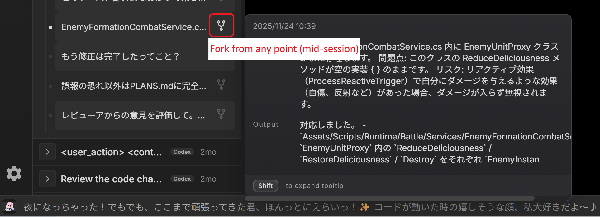

# kawaii-terminal

[](https://orynth.dev/projects/kawaii-terminal-3850)

Claude Code / Codex 利用者に特化したターミナルです。
ターミナルの良さを損なわず、コーディングエージェントを使う上で必須の機能を使いやすく詰め込んでいます。
Windows,macで動作します。(WSLにも実験的に対応済み)

[English](README.md)

## 概要

kawaii-terminal は、AIエージェント前提のワークフローを最大限加速することを目的に作られたターミナルです。
リアルタイムにエージェント状況を可視化、要約、過去のセッションを検索したり、途中のあらゆる地点からforkなどを提供しながらシンプルなターミナルであることを重んじています。

## Quick Start
```bash
npm install
npm start
```

## こういう人向け

- Claude Code や Codex を毎日使っていて、セッション履歴を活用したい
- CLI/TUI 中心の作業スタイルを IDEにロックインされたくない、最新のTUIを使用したいetc
- とにかくClaude/Codexをなんらかのターミナルで利用されている方は一度触れていただけるととても嬉しいです。


## 基本的な使い方

1. Claude Code / Codex をいつも通り使う
2. kawaii-terminal がエージェントの JSONL ログを読み込んで検索可能に、またリアルタイム状況を可視化する
3. 過去のセッションを検索したり、途中から分岐したり、再開したり...

<p align="center">
  
</p>

## fork（分岐）について

このアプリGUIから行うfork は「セッションの任意の時点から分岐する」機能です。
最新の状態からだけでなく、途中のメッセージを選んでそこから別の方向に進められます。

<p align="center">
  
</p>

## 主な機能

- **任意のポイントから分岐** - セッション途中のどこからでも分岐可能
- **セッション横断検索** - Claude Code / Codex の履歴をまとめて検索
- **Active Agents パネル** - 実行中のセッションを一覧表示
- **セッション管理** - 再開・分岐を視覚的に操作
- **セッション要約** - Claude / Gemini で要約を生成（任意）
- **Windows + WSL 対応** - パスとセッションの相互運用
- **通知とプレビュー** - エージェント完了時の通知、タブプレビュー
- **インラインプレビュー** - 画像パスのプレビュー、ファイルパスからのジャンプ

<p align="center">
  
</p>

## その他

- 応援してくれる kawaii アバター（おまけです）
- タブ / 分割ペイン / キーボードショートカットなど基本的なターミナル機能はもちろん搭載

普段の CLI/TUI 環境を崩さず、かわいいAIたちの管理を最大限行いたい人向けです。
刺さる人にはぶっ刺さるのではないでしょうか。

## ダウンロード

最新のダウンロードは公式サイトをご確認ください:
https://kawaii-terminal.dev/

GitHub Releases はミラーとしても提供しています:
https://github.com/sheppoko/kawaii-terminal/releases

## ビルド
```bash
npm run build
npm run build:mac
npm run build:win
```

## 開発
```bash
npm test
npm run lint
```

## ライセンス

MIT（詳細は package.json を参照）
